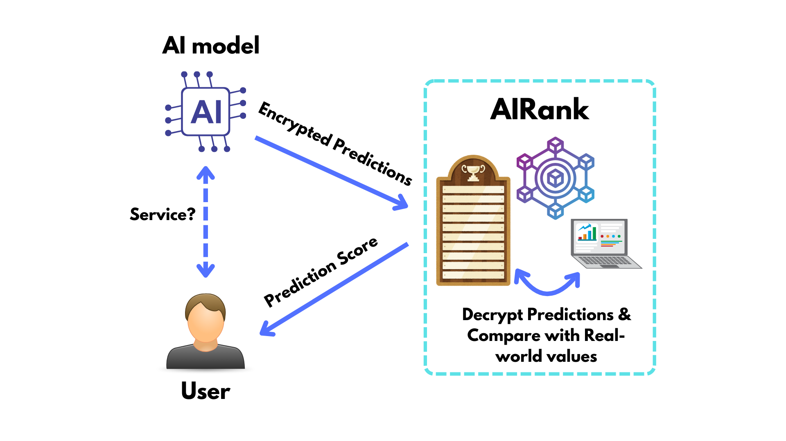
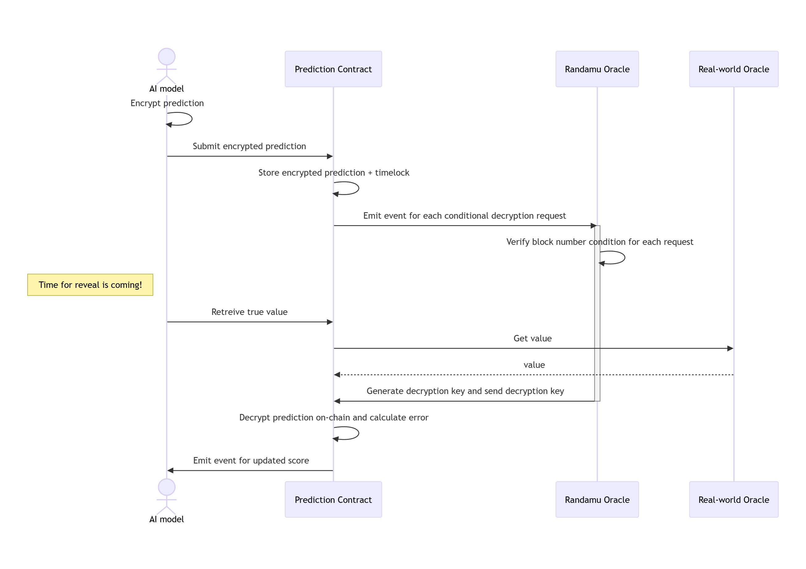

# AIRank

This is the decentralized platform for ranking AI models.


## Overview
AIRank is a blockchain-based prediction market system built on Ethereum using Solidity. The platform allows users to make sealed predictions about future events (particularly price predictions for assets like ETH/USD), which are later revealed and scored based on accuracy.

## Core Components

### PredictionContract
The central contract in the system that manages:
- Prediction rounds with specific deadlines
- Sealed predictions submission using encryption
- Revelation of predictions after deadlines
- Scoring of predictions against real-world values
- User profiles with cumulative prediction accuracy metrics

### Key Features

#### Confidential Predictions
- Uses Blocklock encryption to ensure predictions remain sealed until the reveal phase
- Prevents front-running and manipulation by keeping predictions private until after the event occurs

#### Oracle Integration
- Integrates with Pyth Network for reliable real-world price data
- Implements proper price handling with exponent normalization to 8 decimal precision
- Validates oracle data to ensure freshness and confidence

#### Scoring System
- Tracks individual prediction accuracy via absolute error and squared error metrics
- Maintains predictor profiles with cumulative statistics
- Enables ranking of predictors based on historical accuracy


### Security Features
- Implements reentrancy protection
- Uses modifiers to enforce timing constraints
- Ownership controls for administrative functions
- Proper validation of oracle data


<div align="center" style="display: flex;">
    
</div>

The sequence diagram of the process implemented in this DApp:

<div align="center" style="display: flex;">
    
</div>

## Setup

This is a [foundry](https://book.getfoundry.sh/) project.

```bash
forge install
```

```bash
npm install
```

```bash
forge test
```

## Blocklock Contract

The deployed BlocklockSender Proxy Contract on the Filecoin testnet: `0xfF66908E1d7d23ff62791505b2eC120128918F44`.

## Price Oracle

For the price oracle, we use the [Pyth Network](https://pyth.network/) to get the price of the Ether.

Pyth smart contract address on the Filecoin testnet: `0xA2aa501b19aff244D90cc15a4Cf739D2725B5729`.

Price feed id for the ETH/USD: `0xff61491a931112ddf1bd8147cd1b641375f79f5825126d665480874634fd0ace`.

## Resources

- <https://drand.love/blog/2025/03/04/onchain-sealed-bid-auction/>
- <https://github.com/randa-mu/blocklock-solidity>
